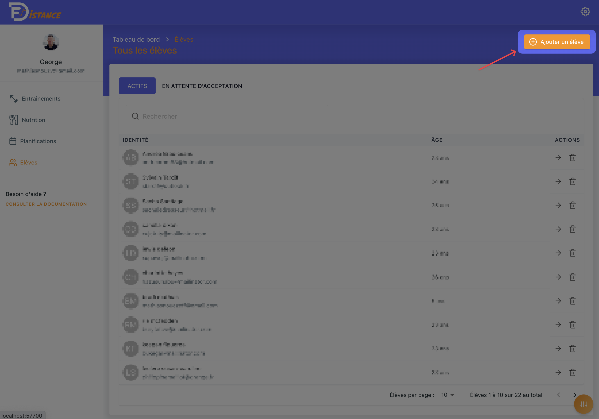

# 1. Ajouter un élève - client

Cette fonctionnalité est réservée aux **coachs**. Rendez-vous dans :

`Accueil` → `Élèves` → `Ajouter un élève`

<!-- img -->

Ajoute **l'adresse e-mail** de l'élève dans la popup qui vient de s'ouvrir.

### C'est tout !

L'élève est maintenant ajouté à ta liste "`En attente d'acceptation`". Il va recevoir un e-mail avec un code pour qu'il puisse s'inscrire sur l'application et que vous soyez liés.
Une fois qu'il a fait cette action, tu pourras lui assigner des planifications et avoir accès à sa page.