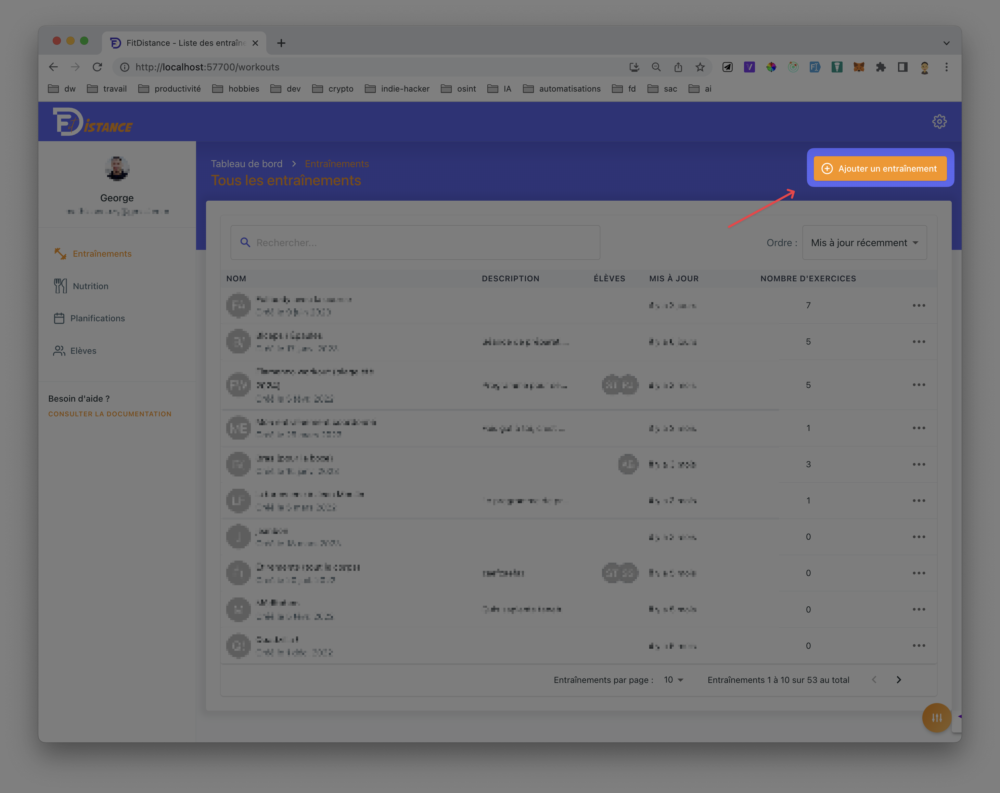

# 2. Créer un entraînement

Cette fonctionnalité est réservée aux **coachs**. Rendez-vous dans :

`Accueil` → `Entraînement` → `Ajouter un entraînement`

## 2.1 - Ajouter un entraînement

## 2.2 - Ajouter le nom et la description

Le nom et la description seront accessibles par l'élève

## 2.3 - Ajouter un ou des exercice(s)

Tu peux choisir parmi **plus de 1000 exercices**. Tu peux aussi filtrer muscle. Il y a environ **50%** des exercices qui ont une vidéo avec **[des modèles anatomiques 3D](https://www.youtube.com/watch?v=zONinSrnLLo)** pour mieux comprendre l'exercice et voir les muscles sollicités.

:::info Bientôt disponible

- Tu pourras aussi ajouter des exercices personnalisés dans la prochaine version de l'application
- Tu pourras trié par équipement et type d'exercice

:::

## 2.4 - Modifier les exercices
Je ne t'apprends rien, chaque exercice à des séries et des répétitions.

### Les attributs d'exercices

Voir tous les attributs

Chaque exercice peut avoir jusqu'à 5 attributs. Un attribut, ou une colonne, peut être :

<ul>
<li><b>Poids :</b> Le poids utilisé pour réaliser la série exprimé en <b>kg</b> ou <b>lbs</b> en haltère, disques de fonte...</li>
<li><b>Poids de corps : </b>Si l'exercice doit se faire au poids du corps</li>
<li><b>Répétitions : </b> Le nombre de répétitions dans la série</li>
<li><b>Temps : </b>Le temps nécéssaire pour réaliser la série.  <i style={{textDecoration: ''}}> Exemple : </i> on peut imaginer faire du curl pendant 45 secondes, peut importe le nombre de répétitions.  À ne pas confondre avec la "Récupération".</li>
<li><b>Tempo : </b>Exprimé sous "EPCP": Excentrique, Pause, Concentrique, Pause.  <i style={{textDecoration: ''}}>Exemple : </i>1221 signifie 1 seconde en Excentrique, 2 secondes de Pause, 2 secondes de Concentrique, 2 secondes de pause. Cela compte pour une répétition</li>
<li><b>Interval de répétitions :</b> Permet de dire "de ... à ..."</li>
<li><b>AMRAP :</b> <b>A</b>s <b>M</b>uch <b>R</b>eps <b>A</b>s <b>P</b>ossible, c'est à dire "Le plus de répétition possible" → à l'échec</li>
<li><b>Récupération :</b> Permet de définir un temps de repos entre chaque série </li>
<li><b>KCAL : </b>Permet de spécifier un nombre à atteindre pour valider la série  <i style={{textDecoration: ''}}>Exemple : </i> 100kcal au rameur</li>
<li><b>Mètres : </b>Permet de spécifier un nombre à mètres pour valider la série  <i style={{textDecoration: ''}}>Exemple : </i> 300m au au tapis</li>

<li><b>RPE : <b>R</b>ate of <b>P</b>erceived <b>E</b>xertion</b>, c'est le "Taux de Perception de l'Effort". C'est un moyen pour les athlètes de quantifier à quel point ils se sentent crevés pendant l'entraînement. Il y a différentes échelles pour mesurer cela. La plus connue est <a href="https://fatsecretfrance.fr/wp-content/uploads/2023/01/Medium_echelle_de_borg.jpg" target="_blank"> l'échelle de Borg </a>
 <i style={{textDecoration: ''}}>Exemple : </i> 1000m de sprint RPE 8
</li>
<li><b>Max :</b> Permet de "brider" l'élève. S'accorde beaucoup avec l'attribut AMRAP </li>
<li><b>Niveau : </b>Permet de spécifier un niveau pour valider la série  <i style={{textDecoration: ''}}>Exemple : </i> 300m au niveau 4 sur l'escalator</li>
<li><b>N/A :</b> Non Assigné → Pas besoin du champ pour la série</li>
</ul>

### La note d'un exercice
Elle permet d'apporter une précision sur l'exercice. Celle-ci sera visible par l'élève.

### La fusion d'exercices
Elle permet de fusionner des exercices entre eux. 
Cela peut permettre de faire des : 
- Supersets (2 exercices à la suite) 
- Trisets (3 exercices à la suite)
- Circuits (au delà de 4 exercices fusionnés à la suite)

