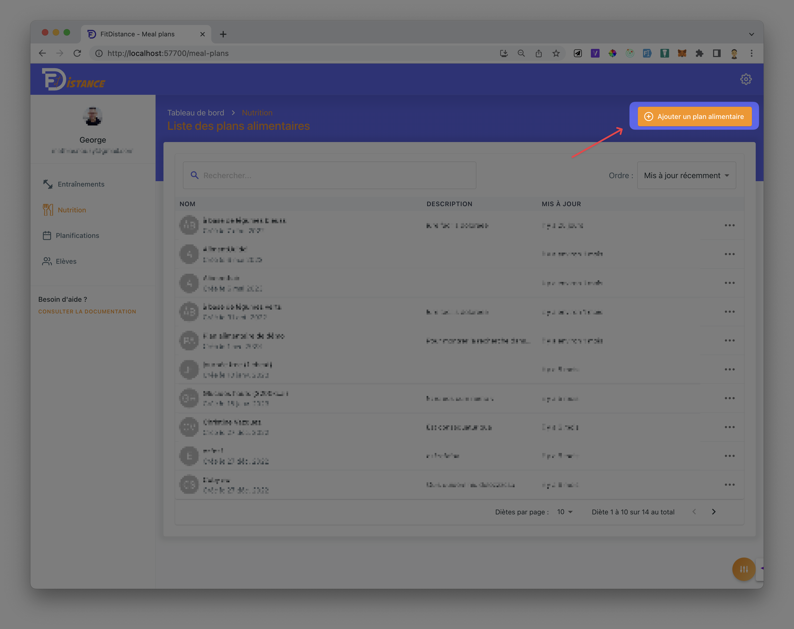
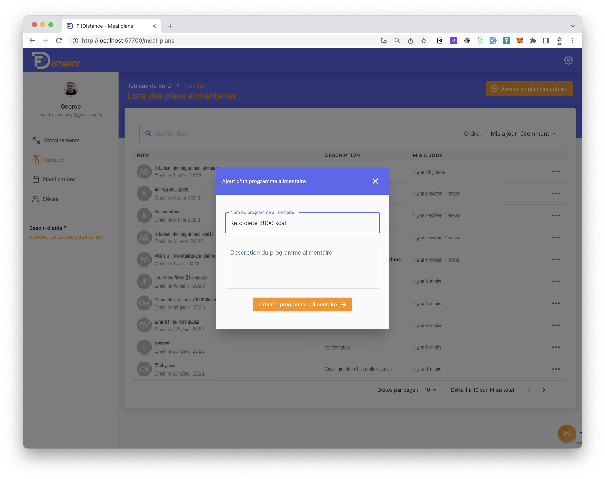

# 3. Créer un plan alimentaire

Cette fonctionnalité est réservée aux **coachs**. Rendez-vous dans :

`Accueil` → `Nutrition` → `Ajouter un plan alimentaire`

## 3.1 - Ajouter un plan alimentaire

## 3.2 - Ajouter le nom et la description
Le nom et la description seront accessibles par l'élève

## 3.3 - Ajouter des aliments
Tu peux ajouter autant d'aliments que tu veux dans un repas. 

:::warning Attention
Tu ne peux pas ajouter plusieurs fois le même aliment dans un repas. Il te sera alors impossible de "Sauvegarder" le plan alimentaire.
:::

## 3.4 - Ajouter ses propres aliments
Tu peux ajouter tes propres aliments dans la base de données.
:::info Information
L'aliment que tu ajoutes, ne sera visible que par toi et tes élèves. Tu pourras les utiliser immédiatement dans tes plans alimentaires, mais nous vérifierons la pertinence de l'aliment avant de le rendre visible pour tous les utilisateurs.
:::

Pour les portions, tu peux utiliser les unités suivantes :
- "c. à café"
- "tasse"
- "g"
- "kg"
- "L"
- "ml"
- "scoop"
- "c. à soupe"
- "mg"
- "portion

## 3.5 - Bonus
- Tu peux ajouter des <b>commentaires</b> à chaque repas. Ces commentaires seront visibles par l'élève.
- Tu peux **modifier l'ordre** des repas en glissant-déposant les repas entre-eux
- Tu peux modifier **le nom** d'un repas
